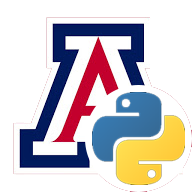

<!--
*** Thanks for checking out the Best-README-Template. If you have a suggestion
*** that would make this better, please fork the repo and create a pull request
*** or simply open an issue with the tag "enhancement".
*** Thanks again! Now go create something AMAZING! :D
***
***
***
*** To avoid retyping too much info. Do a search and replace for the following:
*** nathanacosta, yuma-python-bot, twitter_handle, acostanathan@email.arizona.edu, project_title, project_description
-->


<!-- PROJECT SHIELDS -->
<!--
*** I'm using markdown "reference style" links for readability.
*** Reference links are enclosed in brackets [ ] instead of parentheses ( ).
*** See the bottom of this document for the declaration of the reference variables
*** for contributors-url, forks-url, etc. This is an optional, concise syntax you may use.
*** https://www.markdownguide.org/basic-syntax/#reference-style-links
-->
[![Contributors][contributors-shield]][contributors-url]
[![Forks][forks-shield]][forks-url]
[![Stargazers][stars-shield]][stars-url]
[![Issues][issues-shield]][issues-url]
[![MIT License][license-shield]][license-url]
[![LinkedIn][linkedin-shield]][linkedin-url]


<!-- PROJECT LOGO -->
<br />
<p align="center">
  <a href="https://github.com/nathanacosta/yuma-python-bot">
    
  </a>

  <h3 align="center">Python Yuma Bot</h3>

  <p align="center">
    Python bot created to autmote the student outreach RFI process. Works alongside a Wordpress server using a the Forminator plugin.
    <br />
    <a href="https://github.com/nathanacosta/yuma-python-bot"><strong>Explore the docs »</strong></a>
    <br />
    <br />
    <a href="https://nathanacosta.info">View Demo</a>
    ·
  </p>
</p>


<!-- ABOUT THE PROJECT -->
## About The Project

[![UA Yuma Site][product-screenshot]](images/demo_desktop.gif)
[![UA Yuma Mobile Site][product-demo]](images/demo_mobile.gif)
[![UA Yuma Wallpapers][product-demos]](images/demo_wallpapers.gif)

### Built With

* [LAMP - (Linux, Apache, MySQL, PHP)]()
* [Selenium]()
* [Wordpress]()


<!-- GETTING STARTED -->
## Getting Started

To get the bot running follow these steps.

### Prerequisites

1. Install Python Libraries. (Should be done inside Virtual Enviroment as well)
* pip
  ```sh
  pip install pandas
  pip install pymysql
  pip install selenium
  pip install sqlalchemy
  ```
2. Check that the Wordpress Server is set up correctly 
   * Install Wordpress (if not installed)
   * Forminator Plugin
   * PHPExecSnippets

3. Configure Database View
   * PHPMyAdmin
   * Set Up MySQL Forminator view (see docs/sql.txt)


### Installation

1. Clone the repo (Inside the Linux Server)
   ```sh
   git clone https://github.com/nathanacosta/yuma-python-bot.git
   cd yuma-python-bot
   ```
2. Create a Python Virtual Enviroment
   ```sh
   python -m venv yuma-bot
   ```
   

<!-- USAGE EXAMPLES -->
## Usage

1. Create a screen inside the Linux server.
   ```sh
   screen -S yuma-bot
   ```
2. Navigate to where the bot was installed.

3. Activate Python Virtual Enviroment (source in MacOS and . in Ubuntu)
    ```sh
    . yuma-bot/bin/activate
    ```

4. Execute Script
    ```sh
    python yuma-bot.py
    ```


After executing the bot will run on an infinite loop and we can exit the screen using CTRL + a + d

_Executing inside virtual enviroment_

[![Bot Running][script-demo]](images/demo_script.gif)


<!-- CONTACT -->
## Contact

Nathan Acosta - [@nathanacosta](https://nathanacosta.info) - acostanathan@email.arizona.edu

Project Link: [https://github.com/nathanacosta/yuma-python-bot](https://github.com/nathanacosta/yuma-python-bot)


<!-- MARKDOWN LINKS & IMAGES -->
<!-- https://www.markdownguide.org/basic-syntax/#reference-style-links -->
[contributors-shield]: https://img.shields.io/github/contributors/nathanacosta/repo.svg?style=for-the-badge
[contributors-url]: https://github.com/nathanacosta/repo/graphs/contributors
[forks-shield]: https://img.shields.io/github/forks/nathanacosta/repo.svg?style=for-the-badge
[forks-url]: https://github.com/nathanacosta/repo/network/members
[stars-shield]: https://img.shields.io/github/stars/nathanacosta/repo.svg?style=for-the-badge
[stars-url]: https://github.com/nathanacosta/repo/stargazers
[issues-shield]: https://img.shields.io/github/issues/nathanacosta/repo.svg?style=for-the-badge
[issues-url]: https://github.com/nathanacosta/repo/issues
[license-shield]: https://img.shields.io/github/license/nathanacosta/repo.svg?style=for-the-badge
[license-url]: https://github.com/nathanacosta/repo/blob/master/LICENSE.txt
[linkedin-shield]: https://img.shields.io/badge/-LinkedIn-black.svg?style=for-the-badge&logo=linkedin&colorB=555
[linkedin-url]: https://linkedin.com/in/nathanacosta
